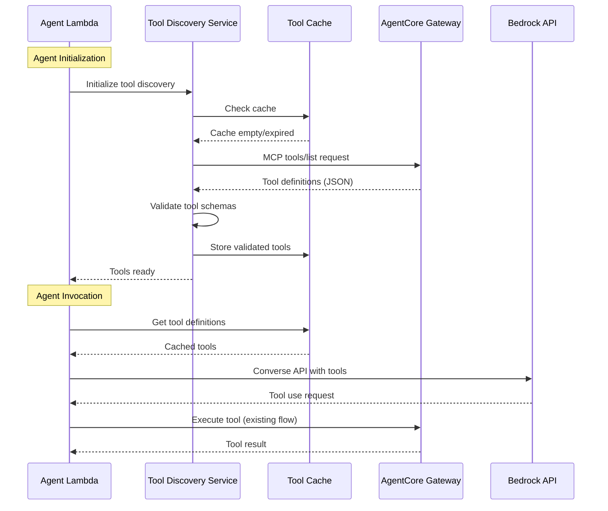

# Design Document: Dynamic Tool Discovery from AgentCore Gateway

## Overview

This design implements dynamic tool discovery for the Agent Lambda by querying the AgentCore Gateway at runtime. The Gateway serves as the single source of truth for tool definitions, eliminating the need for hardcoded tool registries in the Agent Lambda. The system uses the MCP (Model Context Protocol) `tools/list` method to retrieve tool definitions, caches them for performance, and provides fallback mechanisms for resilience.

The architecture shifts from a static, duplicated tool registry to a dynamic discovery model where:
- Gateway maintains tool definitions in its inline schema
- Agent Lambda queries Gateway using MCP protocol
- Tool definitions are cached with configurable TTL
- Fallback to cached definitions when Gateway is unavailable
- No Lambda code changes needed when adding new tools

## Architecture

### Current Architecture (Before)

```
┌─────────────────────┐
│   Agent Lambda      │
│                     │
│  ┌───────────────┐  │
│  │ Hardcoded     │  │
│  │ Tool Registry │  │
│  └───────────────┘  │
│         │           │
│         ▼           │
│  ┌───────────────┐  │
│  │ Bedrock API   │  │
│  │ (Tool List)   │  │
│  └───────────────┘  │
└─────────────────────┘
         │
         ▼
┌─────────────────────┐
│ AgentCore Gateway   │
│                     │
│  ┌───────────────┐  │
│  │ Inline Schema │  │
│  │ (Duplicate)   │  │
│  └───────────────┘  │
└─────────────────────┘
```

**Problem**: Tool definitions exist in TWO places, requiring manual synchronization.

### New Architecture (After)

```
┌─────────────────────────────────────┐
│         Agent Lambda                │
│                                     │
│  ┌──────────────────────────────┐   │
│  │   Tool Discovery Service     │   │
│  │                              │   │
│  │  ┌────────────────────────┐  │   │
│  │  │  Discovery Client      │  │   │
│  │  │  (MCP tools/list)      │  │   │
│  │  └────────────────────────┘  │   │
│  │            │                 │   │
│  │            ▼                 │   │
│  │  ┌────────────────────────┐  │   │
│  │  │  Tool Cache            │  │   │
│  │  │  (TTL-based)           │  │   │
│  │  └────────────────────────┘  │   │
│  │            │                 │   │
│  │            ▼                 │   │
│  │  ┌────────────────────────┐  │   │
│  │  │  Validator             │  │   │
│  │  └────────────────────────┘  │   │
│  └──────────────────────────────┘   │
│              │                      │
│              ▼                      │
│  ┌──────────────────────────────┐   │
│  │   Bedrock API                │   │
│  │   (Tool List)                │   │
│  └──────────────────────────────┘   │
└─────────────────────────────────────┘
              │
              │ MCP tools/list
              ▼
┌─────────────────────────────────────┐
│      AgentCore Gateway              │
│                                     │
│  ┌──────────────────────────────┐   │
│  │   Inline Schema              │   │
│  │   (Single Source of Truth)   │   │
│  └──────────────────────────────┘   │
│              │                      │
│              ▼                      │
│  ┌──────────────────────────────┐   │
│  │   MCP Server                 │   │
│  │   (tools/list endpoint)      │   │
│  └──────────────────────────────┘   │
└─────────────────────────────────────┘
```

### Component Interaction Flow



## Components and Interfaces

### 1. Tool Discovery Service

**Responsibility**: Orchestrates tool discovery from Gateway, manages caching, and provides validated tool definitions to the agent.

**Interface**:
```python
class ToolDiscoveryService:
    """
    Manages dynamic tool discovery from AgentCore Gateway.
    """
    
    def __init__(
        self,
        gateway_client: GatewayClient,
        cache: ToolCache,
        validator: ToolValidator,
        config: DiscoveryConfig
    ):
        """
        Initialize the tool discovery service.
        
        Args:
            gateway_client: Client for communicating with Gateway
            cache: Cache for storing tool definitions
            validator: Validator for tool schemas
            config: Configuration for discovery behavior
        """
        pass
    
    async def discover_tools(self, force_refresh: bool = False) -> List[ToolDefinition]:
        """
        Discover available tools from Gateway.
        
        Args:
            force_refresh: If True, bypass cache and query Gateway
            
        Returns:
            List of validated tool definitions
            
        Raises:
            ToolDiscoveryError: If discovery fails and no fallback available
        """
        pass
    
    async def refresh_cache(self) -> None:
        """
        Manually refresh the tool cache from Gateway.
        
        Raises:
            ToolDiscoveryError: If Gateway is unavailable
        """
        pass
    
    def get_cached_tools(self) -> Optional[List[ToolDefinition]]:
        """
        Get tools from cache without querying Gateway.
        
        Returns:
            Cached tool definitions or None if cache is empty
        """
        pass
```

### 2. Gateway Client

**Responsibility**: Handles MCP protocol communication with AgentCore Gateway for tool discovery.

**Interface**:
```python
class GatewayClient:
    """
    Client for communicating with AgentCore Gateway using MCP protocol.
    """
    
    def __init__(
        self,
        gateway_url: str,
        token_manager: TokenManager,
        timeout: int = 30
    ):
        """
        Initialize Gateway client.
        
        Args:
            gateway_url: Base URL of the Gateway MCP endpoint
            token_manager: Manager for OAuth token handling
            timeout: Request timeout in seconds
        """
        pass
    
    async def list_tools(self, cursor: Optional[str] = None) -> ToolListResponse:
        """
        Query Gateway for available tools using MCP tools/list.
        
        Args:
            cursor: Pagination cursor for retrieving next page
            
        Returns:
            ToolListResponse containing tools and optional next cursor
            
        Raises:
            GatewayConnectionError: If Gateway is unreachable
            GatewayAuthError: If authentication fails
            MCPProtocolError: If response doesn't match MCP protocol
        """
        pass
    
    async def list_all_tools(self) -> List[Dict[str, Any]]:
        """
        Query Gateway for all available tools, handling pagination.
        
        Returns:
            Complete list of tool definitions from Gateway
            
        Raises:
            GatewayConnectionError: If Gateway is unreachable
            GatewayAuthError: If authentication fails
        """
        pass
```

**MCP Protocol Format**:

Request:
```json
{
  "jsonrpc": "2.0",
  "id": 1,
  "method": "tools/list",
  "params": {
    "cursor": "optional_pagination_cursor"
  }
}
```

Response:
```json
{
  "jsonrpc": "2.0",
  "id": 1,
  "result": {
    "tools": [
      {
        "name": "get_weather",
        "description": "Get current weather for a city",
        "inputSchema": {
          "type": "object",
          "properties": {
            "city": {"type": "string"},
            "country": {"type": "string"}
          },
          "required": ["city"]
        }
      }
    ],
    "nextCursor": "optional_cursor_for_next_page"
  }
}
```

### 3. Tool Cache

**Responsibility**: Stores tool definitions with TTL-based expiration and provides fast access.

**Interface**:
```python
class ToolCache:
    """
    Cache for tool definitions with TTL-based expiration.
    """
    
    def __init__(self, ttl_seconds: int = 3600):
        """
        Initialize tool cache.
        
        Args:
            ttl_seconds: Time-to-live for cached entries in seconds
        """
        pass
    
    def get(self) -> Optional[CachedTools]:
        """
        Get cached tool definitions if not expired.
        
        Returns:
            CachedTools object or None if cache is empty/expired
        """
        pass
    
    def set(self, tools: List[ToolDefinition]) -> None:
        """
        Store tool definitions in cache with current timestamp.
        
        Args:
            tools: List of validated tool definitions to cache
        """
        pass
    
    def is_expired(self) -> bool:
        """
        Check if cached tools have exceeded TTL.
        
        Returns:
            True if cache is expired or empty, False otherwise
        """
        pass
    
    def clear(self) -> None:
        """
        Clear all cached tool definitions.
        """
        pass
    
    def get_age_seconds(self) -> Optional[int]:
        """
        Get age of cached data in seconds.
        
        Returns:
            Age in seconds or None if cache is empty
        """
        pass
```

### 4. Tool Validator

**Responsibility**: Validates tool definitions received from Gateway to ensure they are well-formed.

**Interface**:
```python
class ToolValidator:
    """
    Validates tool definitions for correctness and completeness.
    """
    
    def validate_tool(self, tool: Dict[str, Any]) -> ValidationResult:
        """
        Validate a single tool definition.
        
        Args:
            tool: Tool definition dictionary from Gateway
            
        Returns:
            ValidationResult indicating success or failure with details
        """
        pass
    
    def validate_tools(self, tools: List[Dict[str, Any]]) -> List[ToolDefinition]:
        """
        Validate multiple tool definitions, filtering out invalid ones.
        
        Args:
            tools: List of tool definition dictionaries
            
        Returns:
            List of validated ToolDefinition objects (invalid tools excluded)
            
        Note:
            Logs errors for invalid tools but doesn't raise exceptions
        """
        pass
    
    def check_unique_names(self, tools: List[Dict[str, Any]]) -> bool:
        """
        Verify that all tool names are unique.
        
        Args:
            tools: List of tool definitions
            
        Returns:
            True if all names are unique, False otherwise
        """
        pass
```

**Validation Rules**:
1. Tool MUST have `name` field (non-empty string)
2. Tool MUST have `description` field (non-empty string)
3. Tool MUST have `inputSchema` field (valid JSON Schema object)
4. `inputSchema` MUST have `type: "object"`
5. Tool names MUST be unique within the set
6. `inputSchema.properties` MUST be a dictionary if present
7. `inputSchema.required` MUST be an array if present

### 5. Configuration

**Responsibility**: Provides configuration for tool discovery behavior.

**Interface**:
```python
@dataclass
class DiscoveryConfig:
    """
    Configuration for tool discovery service.
    """
    
    # Gateway configuration
    gateway_url: str
    gateway_timeout: int = 30
    
    # Cache configuration
    cache_ttl_seconds: int = 3600  # 1 hour default
    
    # Discovery behavior
    enable_gateway_discovery: bool = True
    fallback_to_local_registry: bool = True
    
    # Error handling
    max_retry_attempts: int = 3
    retry_delay_seconds: int = 5
    
    # Observability
    enable_metrics: bool = True
    log_level: str = "INFO"
```

## Data Models

### ToolDefinition

```python
@dataclass
class ToolDefinition:
    """
    Validated tool definition ready for use with Bedrock.
    """
    name: str
    description: str
    input_schema: Dict[str, Any]
    
    def to_bedrock_format(self) -> Dict[str, Any]:
        """
        Convert to Bedrock Converse API tool format.
        
        Returns:
            Dictionary in Bedrock tool specification format
        """
        return {
            "toolSpec": {
                "name": self.name,
                "description": self.description,
                "inputSchema": {
                    "json": self.input_schema
                }
            }
        }
```

### CachedTools

```python
@dataclass
class CachedTools:
    """
    Tool definitions with cache metadata.
    """
    tools: List[ToolDefinition]
    cached_at: datetime
    ttl_seconds: int
    
    def is_expired(self) -> bool:
        """
        Check if cache has exceeded TTL.
        
        Returns:
            True if expired, False otherwise
        """
        age = (datetime.now() - self.cached_at).total_seconds()
        return age > self.ttl_seconds
    
    def age_seconds(self) -> int:
        """
        Get age of cached data in seconds.
        
        Returns:
            Age in seconds
        """
        return int((datetime.now() - self.cached_at).total_seconds())
```

### ToolListResponse

```python
@dataclass
class ToolListResponse:
    """
    Response from Gateway tools/list request.
    """
    tools: List[Dict[str, Any]]
    next_cursor: Optional[str] = None
    
    def has_more(self) -> bool:
        """
        Check if more pages are available.
        
        Returns:
            True if next_cursor is present, False otherwise
        """
        return self.next_cursor is not None
```

### ValidationResult

```python
@dataclass
class ValidationResult:
    """
    Result of tool validation.
    """
    is_valid: bool
    errors: List[str] = field(default_factory=list)
    warnings: List[str] = field(default_factory=list)
    
    def add_error(self, message: str) -> None:
        """Add validation error."""
        self.is_valid = False
        self.errors.append(message)
    
    def add_warning(self, message: str) -> None:
        """Add validation warning."""
        self.warnings.append(message)
```

## Correctness Properties

*A property is a characteristic or behavior that should hold true across all valid executions of a system—essentially, a formal statement about what the system should do. Properties serve as the bridge between human-readable specifications and machine-verifiable correctness guarantees.*


### Property Reflection

After analyzing all acceptance criteria, I identified the following redundancies:

1. **Properties 1.1 and 1.2** can be combined: Both are about Gateway response structure. Property 1.2 is more specific about required fields, so we can combine them into a single comprehensive property about complete tool definitions.

2. **Properties 2.2 and 2.3** are related but distinct: 2.2 is about cache-first behavior, 2.3 is about TTL-based refresh. These should remain separate as they test different aspects.

3. **Property 4.4 and 8.4** are duplicates: Both test logging warnings when using stale cache. We'll keep only one.

4. **Properties 6.1, 6.2, and 6.3** can be combined: All are about validation and filtering of invalid tools. We can create a single comprehensive property about validation filtering.

5. **Properties 8.1, 8.2, and 8.3** are all about logging: These can be combined into a single property about comprehensive logging behavior.

After reflection, we have the following unique, non-redundant properties:

### Property 1: Gateway returns complete tool definitions
*For any* request to the Gateway for tool definitions, all returned tools should include name, description, and inputSchema fields with valid values.
**Validates: Requirements 1.1, 1.2**

### Property 2: Tool discovery errors are descriptive
*For any* tool discovery failure (network, auth, protocol), the error returned should contain a descriptive message indicating the specific failure reason.
**Validates: Requirements 1.4**

### Property 3: Retrieved tools are cached
*For any* set of tool definitions successfully retrieved from the Gateway, those tools should be stored in the local cache.
**Validates: Requirements 2.1**

### Property 4: Cache-first retrieval
*For any* request for tool definitions when valid cached tools exist, the cache should be checked and used before querying the Gateway.
**Validates: Requirements 2.2**

### Property 5: TTL-based cache expiration
*For any* cached tool definitions, if the cache age exceeds the configured TTL, the cache should be considered expired and trigger a refresh.
**Validates: Requirements 2.3, 2.4**

### Property 6: Manual refresh queries Gateway
*For any* manual cache refresh trigger, the system should query the Gateway for updated tool definitions.
**Validates: Requirements 3.2**

### Property 7: Atomic cache updates
*For any* cache update operation, the replacement of cached definitions should be atomic, with no intermediate state visible to concurrent readers.
**Validates: Requirements 3.3**

### Property 8: Non-blocking refresh
*For any* cache refresh operation in progress, concurrent requests for tool definitions should continue to receive the existing cached tools without blocking.
**Validates: Requirements 3.4**

### Property 9: Fallback to cache on Gateway failure
*For any* Gateway unavailability scenario, if valid cached tool definitions exist, those cached definitions should be returned instead of failing.
**Validates: Requirements 4.1**

### Property 10: Cache refresh after Gateway recovery
*For any* scenario where the Gateway becomes available after being unavailable, the cache should be refreshed on the next scheduled refresh cycle.
**Validates: Requirements 4.3**

### Property 11: Stale cache warning
*For any* use of cached tool definitions when the Gateway is unavailable, a warning should be logged indicating stale cache usage with the cache age.
**Validates: Requirements 4.4, 8.4**

### Property 12: Bedrock format compatibility
*For any* tool definition converted to Bedrock format, the output format should match the structure used by the legacy hardcoded registry (toolSpec with name, description, and inputSchema.json).
**Validates: Requirements 5.1**

### Property 13: Configuration-based fallback to local registry
*For any* configuration where Gateway-based discovery is disabled, the system should use the local hardcoded registry instead of querying the Gateway.
**Validates: Requirements 5.4**

### Property 14: Validation filters invalid tools
*For any* set of tool definitions retrieved from the Gateway, tools missing required fields (name, description, inputSchema) or containing invalid schemas should be filtered out and logged as errors.
**Validates: Requirements 6.1, 6.2, 6.3**

### Property 15: Unique tool names
*For any* set of validated tool definitions, all tool names should be unique within that set.
**Validates: Requirements 6.4**

### Property 16: Default configuration values
*For any* configuration parameter that is not explicitly provided, the system should use a sensible default value (e.g., 3600 seconds for TTL, true for enable_gateway_discovery).
**Validates: Requirements 7.5**

### Property 17: Comprehensive logging
*For any* tool discovery operation (success, failure, or cache refresh), the system should log appropriate information including tool count on success, error details on failure, and timestamp on refresh.
**Validates: Requirements 8.1, 8.2, 8.3**

## Error Handling

### Error Types

1. **GatewayConnectionError**
   - Raised when: Gateway is unreachable (network error, timeout)
   - Handling: Log error, attempt fallback to cache, retry with exponential backoff
   - User impact: Transparent if cache available, error if no cache

2. **GatewayAuthError**
   - Raised when: OAuth token is invalid or expired
   - Handling: Attempt token refresh, retry request, log auth failure
   - User impact: Transparent if token refresh succeeds, error otherwise

3. **MCPProtocolError**
   - Raised when: Gateway response doesn't match MCP protocol format
   - Handling: Log protocol violation details, attempt fallback to cache
   - User impact: Transparent if cache available, error if no cache

4. **ToolValidationError**
   - Raised when: Tool definition fails validation
   - Handling: Log validation errors, exclude invalid tool, continue with valid tools
   - User impact: Transparent (invalid tools filtered out)

5. **ToolDiscoveryError**
   - Raised when: Discovery fails and no fallback available
   - Handling: Log comprehensive error, return error to caller
   - User impact: Agent initialization fails or tool list unavailable

### Error Handling Strategy

```python
async def discover_tools(self, force_refresh: bool = False) -> List[ToolDefinition]:
    """
    Discover tools with comprehensive error handling.
    """
    # Try cache first (unless force refresh)
    if not force_refresh:
        cached = self.cache.get()
        if cached and not cached.is_expired():
            logger.info(f"Using cached tools (age: {cached.age_seconds()}s)")
            return cached.tools
    
    # Query Gateway with retry logic
    for attempt in range(self.config.max_retry_attempts):
        try:
            # Get tools from Gateway
            raw_tools = await self.gateway_client.list_all_tools()
            
            # Validate and filter
            validated_tools = self.validator.validate_tools(raw_tools)
            
            # Cache validated tools
            self.cache.set(validated_tools)
            
            logger.info(f"Discovered {len(validated_tools)} tools from Gateway")
            return validated_tools
            
        except GatewayAuthError as e:
            logger.error(f"Gateway auth failed: {e}")
            # Try token refresh
            await self.gateway_client.token_manager.refresh_token()
            continue
            
        except (GatewayConnectionError, MCPProtocolError) as e:
            logger.warning(f"Gateway error (attempt {attempt + 1}): {e}")
            if attempt < self.config.max_retry_attempts - 1:
                await asyncio.sleep(self.config.retry_delay_seconds)
                continue
            
            # Final attempt failed, try cache fallback
            cached = self.cache.get()
            if cached:
                logger.warning(
                    f"Using stale cached tools (age: {cached.age_seconds()}s) "
                    f"due to Gateway unavailability"
                )
                return cached.tools
            
            # No cache available
            raise ToolDiscoveryError(
                f"Gateway unavailable and no cached tools available: {e}"
            )
    
    # Should not reach here
    raise ToolDiscoveryError("Tool discovery failed after all retries")
```

### Fallback Decision Tree

```
Tool Discovery Request
        │
        ▼
    Force Refresh?
    ┌───┴───┐
   No      Yes
    │       │
    ▼       │
Cache Valid?│
 ┌──┴──┐   │
Yes    No   │
 │      │   │
 │      └───┤
 │          ▼
 │    Query Gateway
 │      ┌───┴───┐
 │   Success  Failure
 │      │       │
 │      ▼       ▼
 │   Cache   Cache Valid?
 │   Tools   ┌───┴───┐
 │      │   Yes     No
 │      │    │       │
 │      │    ▼       ▼
 │      │  Return  Error
 │      │  Stale
 │      │  Cache
 │      │    │
 └──────┴────┘
        │
        ▼
   Return Tools
```

## Testing Strategy

### Dual Testing Approach

This feature requires both unit tests and property-based tests for comprehensive coverage:

**Unit Tests** focus on:
- Specific examples of tool definitions
- Edge cases (empty responses, malformed JSON)
- Error conditions (network failures, auth errors)
- Integration points (Gateway client, cache, validator)
- Configuration scenarios

**Property-Based Tests** focus on:
- Universal properties across all inputs
- Validation rules for arbitrary tool definitions
- Cache behavior with random TTL values
- Concurrent access patterns
- Format conversion correctness

### Property-Based Testing Configuration

- **Library**: Use `hypothesis` for Python (industry-standard PBT library)
- **Iterations**: Minimum 100 iterations per property test
- **Tagging**: Each property test must reference its design property
- **Tag Format**: `# Feature: dynamic-tool-discovery, Property {number}: {property_text}`

### Test Organization

```
tests/
├── unit/
│   ├── test_gateway_client.py
│   ├── test_tool_cache.py
│   ├── test_tool_validator.py
│   └── test_discovery_service.py
├── property/
│   ├── test_gateway_properties.py
│   ├── test_cache_properties.py
│   ├── test_validation_properties.py
│   └── test_format_properties.py
└── integration/
    ├── test_end_to_end_discovery.py
    └── test_fallback_scenarios.py
```

### Key Test Scenarios

**Unit Test Examples**:
1. Gateway returns empty tool list
2. Gateway returns malformed JSON
3. Cache expires exactly at TTL boundary
4. Concurrent cache refresh and read
5. Token refresh during discovery
6. All configuration parameters set to non-defaults

**Property Test Examples**:
1. For any valid tool definition, validation should succeed
2. For any tool missing required fields, validation should fail
3. For any cache age > TTL, cache should be expired
4. For any set of tools, conversion to Bedrock format should be reversible
5. For any concurrent reads during refresh, no partial state should be visible

### Integration Testing

Integration tests should verify:
1. End-to-end discovery from real Gateway (test environment)
2. Fallback behavior when Gateway is actually unavailable
3. Token refresh flow with real OAuth provider
4. Cache persistence across Lambda cold starts (if applicable)
5. Metrics emission to CloudWatch (if implemented)

### Mocking Strategy

For unit tests, mock:
- Gateway HTTP responses (use `aioresponses` or similar)
- OAuth token manager
- Time (for TTL testing)
- Logger (to verify log messages)

For property tests, use:
- Hypothesis strategies for generating tool definitions
- In-memory cache (no mocking needed)
- Synchronous validator (no mocking needed)

Do NOT mock:
- Core business logic (cache, validator)
- Data structures (ToolDefinition, CachedTools)
- Configuration objects

## Implementation Notes

### Performance Considerations

1. **Cache Warming**: Populate cache during Lambda initialization (cold start) to avoid discovery latency on first request
2. **Pagination**: Gateway may return paginated results; client must handle `nextCursor` to retrieve all tools
3. **Concurrent Requests**: Use asyncio locks to prevent multiple simultaneous Gateway queries during cache refresh
4. **Token Caching**: OAuth tokens should be cached and reused across requests (token manager responsibility)

### Backward Compatibility

To maintain backward compatibility:

1. **Feature Flag**: Add `ENABLE_GATEWAY_DISCOVERY` environment variable (default: `false` initially)
2. **Gradual Rollout**: Deploy with feature disabled, enable for canary testing, then full rollout
3. **Fallback Registry**: Keep existing hardcoded registry as fallback when feature is disabled
4. **Format Preservation**: Ensure `ToolDefinition.to_bedrock_format()` produces identical output to current code

### Migration Path

1. **Phase 1**: Deploy code with feature disabled, verify no regressions
2. **Phase 2**: Enable for internal testing, verify Gateway integration works
3. **Phase 3**: Enable for canary deployment (10% of traffic)
4. **Phase 4**: Full rollout (100% of traffic)
5. **Phase 5**: Remove hardcoded registry (after monitoring period)

### Observability

Emit the following metrics:
- `tool_discovery.success` (count)
- `tool_discovery.failure` (count)
- `tool_discovery.latency` (milliseconds)
- `tool_cache.hit` (count)
- `tool_cache.miss` (count)
- `tool_cache.age` (seconds)
- `tool_validation.invalid_count` (count)

Log the following events:
- Tool discovery initiated (INFO)
- Tools discovered successfully with count (INFO)
- Tool discovery failed with error details (ERROR)
- Cache hit with age (DEBUG)
- Cache miss (DEBUG)
- Cache refresh triggered (INFO)
- Stale cache used due to Gateway unavailability (WARNING)
- Invalid tool filtered out with validation errors (WARNING)

### Security Considerations

1. **Token Security**: OAuth tokens must be stored securely (use AWS Secrets Manager or environment variables)
2. **Gateway Authentication**: Always use HTTPS for Gateway communication
3. **Input Validation**: Validate all tool definitions from Gateway (don't trust external input)
4. **Rate Limiting**: Implement rate limiting for Gateway queries to prevent abuse
5. **Error Messages**: Don't expose sensitive information in error messages (e.g., internal URLs, credentials)

### Configuration Example

```python
# Environment variables
GATEWAY_URL = "https://gateway.example.com/mcp"
GATEWAY_CLIENT_ID = "client-id-from-secrets-manager"
GATEWAY_CLIENT_SECRET = "client-secret-from-secrets-manager"
GATEWAY_TOKEN_ENDPOINT = "https://auth.example.com/oauth/token"
GATEWAY_SCOPE = "tools:read"

# Discovery configuration
ENABLE_GATEWAY_DISCOVERY = "true"
TOOL_CACHE_TTL_SECONDS = "3600"  # 1 hour
GATEWAY_TIMEOUT_SECONDS = "30"
MAX_RETRY_ATTEMPTS = "3"
RETRY_DELAY_SECONDS = "5"

# Fallback configuration
FALLBACK_TO_LOCAL_REGISTRY = "true"
```

### Future Enhancements

1. **Tool Change Notifications**: Implement MCP `tools/list_changed` notification to proactively refresh cache when Gateway tools change
2. **Selective Tool Discovery**: Allow filtering tools by category or capability during discovery
3. **Tool Versioning**: Support versioned tool definitions to enable gradual tool updates
4. **Multi-Gateway Support**: Support discovering tools from multiple Gateway instances
5. **Tool Metrics**: Track per-tool usage metrics to identify popular/unused tools
