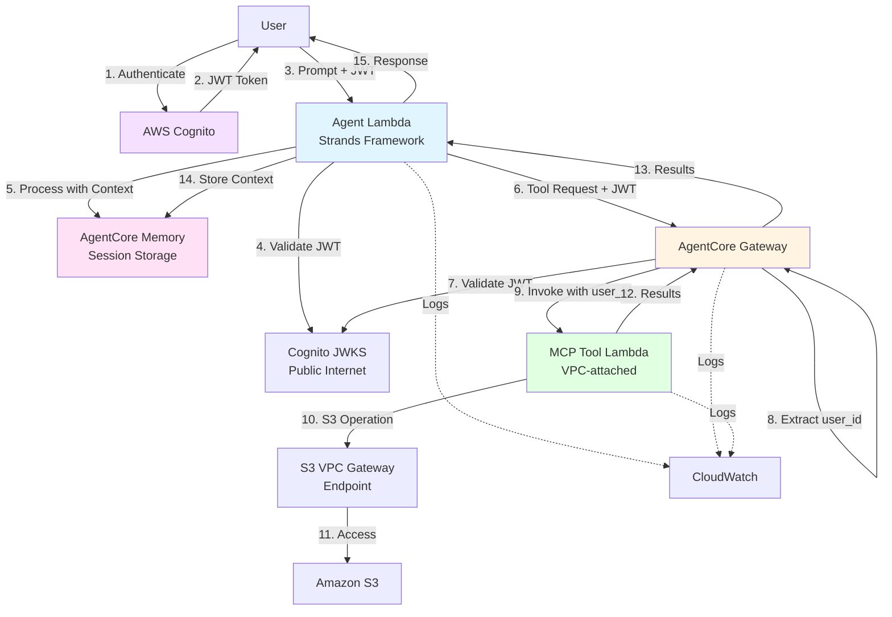
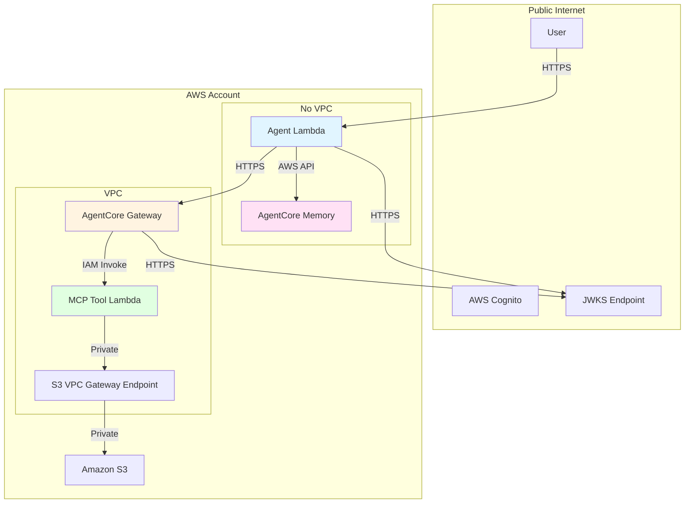

# Design Document: Serverless AI Agent System

## Overview

This design document describes a comprehensive serverless AI agent system that enables natural language interaction with AWS services through a secure, multi-tenant architecture. The system demonstrates modern cloud-native patterns including:

- **AI-Powered Interaction**: Strands Framework agent using Claude 3 Sonnet for natural language understanding
- **Secure Multi-Tenancy**: Complete user context propagation with JWT-based authentication
- **Standardized Tool Communication**: Model Context Protocol (MCP) for extensible tool integration
- **Conversation Memory**: AgentCore Memory for persistent context across multi-turn conversations
- **Gateway-Mediated Architecture**: AgentCore Gateway for secure tool orchestration
- **Infrastructure as Code**: CloudFormation-based deployment with proper network isolation

### Key Design Decisions

1. **Dual Lambda Architecture**: Separate Agent Lambda (public) and Tool Lambda (VPC-attached) to balance Cognito JWKS access with secure AWS service integration
2. **AgentCore Gateway Integration**: Centralized gateway for MCP tool communication, authentication, and user context propagation
3. **Session-Based Memory**: AgentCore Memory with session identifiers for conversation context management
4. **VPC Gateway Endpoint**: Cost-effective S3 access through VPC Gateway endpoint instead of Interface endpoint
5. **Stateless Agent Design**: Agent Lambda remains stateless while AgentCore Memory provides persistence

## Architecture

### System Components



### Request Flow

1. **Authentication Phase**
   - User authenticates with AWS Cognito using username/password
   - Cognito validates credentials and issues JWT access token
   - JWT contains claims: `cognito:username`, `sub`, `client_id`

2. **Agent Processing Phase**
   - User submits natural language prompt with JWT token
   - Agent Lambda validates JWT using Cognito JWKS (public internet access)
   - Agent extracts User_Context from JWT claims
   - Agent retrieves conversation history from AgentCore Memory using session ID
   - Agent processes prompt using Strands Framework with Claude 3 Sonnet
   - Agent determines if tool execution is required

3. **Tool Execution Phase** (if needed)
   - Agent invokes AgentCore Gateway with JWT token and tool request
   - Gateway validates JWT independently against Cognito JWKS
   - Gateway extracts user_id from JWT claims
   - Gateway invokes MCP Tool Lambda with user_id in event payload
   - Tool Lambda executes AWS operation (e.g., S3 ListBuckets) through VPC endpoint
   - Tool Lambda returns results with user attribution

4. **Response Phase**
   - Agent receives tool results from Gateway
   - Agent generates natural language response
   - Agent stores conversation context in AgentCore Memory
   - Agent returns response to user with complete audit trail

### Network Architecture



**Key Network Design Points:**

1. **Agent Lambda (No VPC)**: Must access public internet for Cognito JWKS validation
2. **Tool Lambda (VPC-attached)**: Secure AWS service access through VPC endpoints
3. **VPC Gateway Endpoint**: Cost-effective S3 access (no data transfer charges)
4. **AgentCore Gateway**: Validates JWT directly, no VPC dependency for JWKS
5. **Private Communication**: Tool-to-S3 traffic stays within AWS network

## Components and Interfaces

### 1. Agent Lambda (Strands Framework)

**Purpose**: Process natural language prompts using AI and orchestrate tool execution

**Technology Stack**:
- Runtime: Python 3.12
- Framework: Strands Framework
- AI Model: Claude 3 Sonnet via AWS Bedrock
- Memory: AgentCore Memory with session management

**Input Interface**:
```python
{
    "prompt": str,              # User's natural language input
    "jwt_token": str,           # JWT access token from Cognito
    "session_id": str | None    # Optional session ID for conversation continuity
}
```

**Output Interface**:
```python
{
    "response": str,            # Natural language response
    "session_id": str,          # Session ID for conversation tracking
    "user_context": {
        "user_id": str,         # Cognito sub claim
        "username": str,        # Cognito username claim
        "client_id": str        # Cognito client_id claim
    },
    "tool_executions": [        # List of tools executed (for audit)
        {
            "tool_name": str,
            "timestamp": str,
            "status": str
        }
    ]
}
```

**Key Responsibilities**:
- Validate JWT token using Cognito JWKS
- Extract user context from JWT claims
- Manage conversation sessions with AgentCore Memory
- Process prompts using Strands Framework and Claude model
- Determine when tool execution is required
- Invoke tools through AgentCore Gateway
- Generate natural language responses
- Log all operations with user context

**Configuration**:
```python
{
    "cognito_jwks_url": str,        # Cognito JWKS discovery URL
    "bedrock_model_id": str,        # Claude model identifier
    "agentcore_gateway_url": str,   # Gateway endpoint
    "agentcore_memory_id": str,     # Memory resource identifier
    "session_timeout_minutes": int,  # Session expiration time
    "max_context_tokens": int       # Maximum context size for memory retrieval
}
```

### 2. AgentCore Gateway

**Purpose**: Mediate communication between Agent and MCP tools with authentication and user context propagation

**Configuration**:
- Gateway Type: MCP Gateway
- Target: Lambda function (MCP Tool)
- Authentication: JWT validation against Cognito
- User Context Extraction: Automatic from JWT claims

**Input Interface** (from Agent):
```python
{
    "tool_name": str,           # MCP tool identifier
    "tool_input": dict,         # Tool-specific parameters
    "jwt_token": str            # JWT for authentication
}
```

**Output Interface** (to Agent):
```python
{
    "tool_output": dict,        # Tool execution results
    "user_id": str,             # User attribution
    "execution_metadata": {
        "timestamp": str,
        "duration_ms": int,
        "status": str
    }
}
```

**Gateway Processing**:
1. Receive tool invocation request from Agent
2. Validate JWT token against Cognito JWKS
3. Extract user_id from JWT `sub` claim
4. Invoke target Lambda (MCP Tool) with user_id in event
5. Return tool results to Agent

**Key Features**:
- Independent JWT validation (doesn't rely on Agent validation)
- Automatic user context extraction and propagation
- IAM-based Lambda invocation
- Request/response logging with user attribution
- Error handling and retry logic

### 3. MCP Tool Lambda (S3 Operations)

**Purpose**: Execute AWS service operations following MCP protocol with user attribution

**Technology Stack**:
- Runtime: Python 3.12
- Protocol: Model Context Protocol (MCP)
- AWS SDK: boto3
- Network: VPC-attached with S3 VPC Gateway endpoint

**Input Interface** (from AgentCore Gateway):
```python
{
    "tool_name": str,           # "list_s3_buckets"
    "parameters": dict,         # Tool-specific parameters
    "user_context": {
        "user_id": str          # From Gateway JWT extraction
    }
}
```

**Output Interface** (to AgentCore Gateway):
```python
{
    "result": dict,             # Tool execution results
    "user_attribution": {
        "user_id": str,
        "operation": str,
        "timestamp": str
    },
    "metadata": {
        "execution_time_ms": int,
        "aws_request_id": str
    }
}
```

**MCP Tool Implementation**:
```python
# Tool definition following MCP protocol
{
    "name": "list_s3_buckets",
    "description": "List all S3 buckets in the account",
    "input_schema": {
        "type": "object",
        "properties": {},
        "required": []
    }
}
```

**Key Responsibilities**:
- Implement MCP protocol interface
- Execute AWS service operations (S3 ListBuckets)
- Use VPC Gateway endpoint for S3 access
- Include user attribution in all operations
- Log operations with user context
- Handle AWS service errors gracefully
- Return structured results

**IAM Permissions Required**:
```json
{
    "Version": "2012-10-17",
    "Statement": [
        {
            "Effect": "Allow",
            "Action": [
                "s3:ListAllMyBuckets",
                "s3:GetBucketLocation"
            ],
            "Resource": "*"
        }
    ]
}
```

### 4. AgentCore Memory

**Purpose**: Provide persistent conversation context storage with session management

**Integration Pattern**:
- Service: AWS Bedrock AgentCore Memory
- Access: AWS SDK (boto3) from Agent Lambda
- Isolation: User-scoped memory with session identifiers

**Memory Structure**:
```python
{
    "session_id": str,          # Unique session identifier
    "user_id": str,             # User identity for isolation
    "conversation_history": [
        {
            "role": "user",
            "content": str,
            "timestamp": str
        },
        {
            "role": "assistant",
            "content": str,
            "timestamp": str,
            "tool_calls": [...]  # Optional tool execution details
        }
    ],
    "metadata": {
        "created_at": str,
        "last_updated": str,
        "message_count": int
    }
}
```

**Operations**:

1. **Create Session**:
```python
def create_session(user_id: str) -> str:
    """Create new conversation session"""
    # Returns: session_id
```

2. **Store Message**:
```python
def store_message(
    session_id: str,
    role: str,
    content: str,
    tool_calls: list = None
) -> None:
    """Store conversation message"""
```

3. **Retrieve Context**:
```python
def retrieve_context(
    session_id: str,
    max_messages: int = 10
) -> list:
    """Retrieve recent conversation history"""
    # Returns: list of messages
```

4. **Expire Session**:
```python
def expire_session(session_id: str) -> None:
    """Mark session as expired"""
```

**Configuration**:
```python
{
    "memory_resource_id": str,      # AgentCore Memory identifier
    "session_timeout_minutes": int,  # Default: 60
    "max_context_messages": int,     # Default: 10
    "max_context_tokens": int        # Default: 4000
}
```

### 5. AWS Cognito User Pool

**Purpose**: Provide OAuth2 authentication and JWT token generation

**Configuration**:
- User Pool: Standard configuration with username/password
- App Client: OAuth2 client for token generation
- Token Expiration: Configurable (default 1 hour)

**JWT Token Structure**:
```json
{
    "sub": "user-uuid",
    "cognito:username": "john.doe",
    "client_id": "app-client-id",
    "token_use": "access",
    "scope": "aws.cognito.signin.user.admin",
    "auth_time": 1234567890,
    "iss": "https://cognito-idp.region.amazonaws.com/pool-id",
    "exp": 1234571490,
    "iat": 1234567890
}
```

**JWKS Endpoint**:
```
https://cognito-idp.{region}.amazonaws.com/{user-pool-id}/.well-known/jwks.json
```

### Interface Contracts

**Agent → AgentCore Gateway**:
- Protocol: HTTPS REST API
- Authentication: JWT token in Authorization header
- Format: JSON
- Timeout: 30 seconds

**AgentCore Gateway → MCP Tool**:
- Protocol: Lambda invocation (IAM-based)
- Format: JSON event payload
- User Context: Included in event
- Timeout: 15 seconds

**Agent → AgentCore Memory**:
- Protocol: AWS SDK (boto3)
- Authentication: IAM execution role
- Operations: Create, Store, Retrieve, Expire
- Timeout: 5 seconds

**All Components → CloudWatch**:
- Protocol: AWS SDK (boto3)
- Log Format: Structured JSON
- Required Fields: timestamp, request_id, user_context

## Data Models

### User Context

```python
from dataclasses import dataclass
from typing import Optional

@dataclass
class UserContext:
    """Complete user identity information"""
    user_id: str        # Cognito sub claim (UUID)
    username: str       # Cognito username claim
    client_id: str      # Cognito client_id claim
    
    @classmethod
    def from_jwt_claims(cls, claims: dict) -> 'UserContext':
        """Extract user context from JWT claims"""
        return cls(
            user_id=claims['sub'],
            username=claims['cognito:username'],
            client_id=claims['client_id']
        )
    
    def to_dict(self) -> dict:
        """Convert to dictionary for logging/transmission"""
        return {
            'user_id': self.user_id,
            'username': self.username,
            'client_id': self.client_id
        }
```

### Conversation Session

```python
from dataclasses import dataclass, field
from datetime import datetime
from typing import List, Optional

@dataclass
class ConversationMessage:
    """Single message in conversation"""
    role: str           # "user" or "assistant"
    content: str        # Message content
    timestamp: datetime
    tool_calls: Optional[List[dict]] = None
    
    def to_dict(self) -> dict:
        return {
            'role': self.role,
            'content': self.content,
            'timestamp': self.timestamp.isoformat(),
            'tool_calls': self.tool_calls
        }

@dataclass
class ConversationSession:
    """Conversation session with history"""
    session_id: str
    user_id: str
    messages: List[ConversationMessage] = field(default_factory=list)
    created_at: datetime = field(default_factory=datetime.utcnow)
    last_updated: datetime = field(default_factory=datetime.utcnow)
    
    def add_message(self, role: str, content: str, tool_calls: Optional[List[dict]] = None):
        """Add message to conversation"""
        message = ConversationMessage(
            role=role,
            content=content,
            timestamp=datetime.utcnow(),
            tool_calls=tool_calls
        )
        self.messages.append(message)
        self.last_updated = datetime.utcnow()
    
    def get_recent_messages(self, count: int = 10) -> List[ConversationMessage]:
        """Get most recent messages"""
        return self.messages[-count:]
    
    def to_dict(self) -> dict:
        return {
            'session_id': self.session_id,
            'user_id': self.user_id,
            'messages': [m.to_dict() for m in self.messages],
            'created_at': self.created_at.isoformat(),
            'last_updated': self.last_updated.isoformat(),
            'message_count': len(self.messages)
        }
```

### MCP Tool Request/Response

```python
from dataclasses import dataclass
from typing import Any, Dict, Optional

@dataclass
class MCPToolRequest:
    """Request to execute MCP tool"""
    tool_name: str
    parameters: Dict[str, Any]
    user_context: UserContext
    request_id: str
    
    def to_dict(self) -> dict:
        return {
            'tool_name': self.tool_name,
            'parameters': self.parameters,
            'user_context': self.user_context.to_dict(),
            'request_id': self.request_id
        }

@dataclass
class MCPToolResponse:
    """Response from MCP tool execution"""
    result: Dict[str, Any]
    user_attribution: Dict[str, str]
    execution_time_ms: int
    status: str  # "success" or "error"
    error_message: Optional[str] = None
    
    def to_dict(self) -> dict:
        return {
            'result': self.result,
            'user_attribution': self.user_attribution,
            'execution_time_ms': self.execution_time_ms,
            'status': self.status,
            'error_message': self.error_message
        }
```

### Agent Response

```python
from dataclasses import dataclass
from typing import List, Optional

@dataclass
class ToolExecution:
    """Record of tool execution"""
    tool_name: str
    timestamp: str
    status: str
    duration_ms: int

@dataclass
class AgentResponse:
    """Complete agent response"""
    response: str
    session_id: str
    user_context: UserContext
    tool_executions: List[ToolExecution]
    request_id: str
    
    def to_dict(self) -> dict:
        return {
            'response': self.response,
            'session_id': self.session_id,
            'user_context': self.user_context.to_dict(),
            'tool_executions': [
                {
                    'tool_name': te.tool_name,
                    'timestamp': te.timestamp,
                    'status': te.status,
                    'duration_ms': te.duration_ms
                }
                for te in self.tool_executions
            ],
            'request_id': self.request_id
        }
```

### Audit Log Entry

```python
from dataclasses import dataclass
from datetime import datetime
from typing import Optional

@dataclass
class AuditLogEntry:
    """Structured audit log entry"""
    timestamp: datetime
    request_id: str
    component: str  # "agent", "gateway", "tool"
    operation: str
    user_context: UserContext
    status: str
    duration_ms: Optional[int] = None
    error_message: Optional[str] = None
    metadata: Optional[dict] = None
    
    def to_cloudwatch_format(self) -> dict:
        """Format for CloudWatch structured logging"""
        return {
            'timestamp': self.timestamp.isoformat(),
            'request_id': self.request_id,
            'component': self.component,
            'operation': self.operation,
            'user_id': self.user_context.user_id,
            'username': self.user_context.username,
            'client_id': self.user_context.client_id,
            'status': self.status,
            'duration_ms': self.duration_ms,
            'error_message': self.error_message,
            'metadata': self.metadata or {}
        }
```


## Correctness Properties

A property is a characteristic or behavior that should hold true across all valid executions of a system—essentially, a formal statement about what the system should do. Properties serve as the bridge between human-readable specifications and machine-verifiable correctness guarantees.

### Authentication and User Context Properties

**Property 1: JWT Claim Extraction Completeness**
*For any* valid JWT token containing `cognito:username`, `sub`, and `client_id` claims, extracting user context should produce a UserContext object with all three fields populated correctly.
**Validates: Requirements 1.2, 3.1**

**Property 2: JWT Validation Correctness**
*For any* JWT token, validation using JWKS should return true if and only if the token is properly signed, not expired, and issued by the configured Cognito pool.
**Validates: Requirements 1.3, 8.2**

**Property 3: Invalid Token Rejection**
*For any* invalid JWT token (malformed, expired, wrong signature, or missing required claims), the system should reject the request and return an error without exposing sensitive information.
**Validates: Requirements 1.4, 9.1**

**Property 4: User Context Preservation**
*For any* user context extracted from a JWT token, the context should remain identical (invariant) as it flows through Agent → Gateway → Tool layers.
**Validates: Requirements 3.2, 3.5**

**Property 5: User Context Propagation Completeness**
*For any* request processed by the system, user context (user_id, username, client_id) should be present in logs at every layer (Agent, Gateway, Tool).
**Validates: Requirements 3.6, 6.2, 6.3, 6.4**

### Conversation Memory Properties

**Property 6: Session ID Uniqueness**
*For any* two new conversations started by the same or different users, the generated session identifiers should be unique.
**Validates: Requirements 2.8, 11.1**

**Property 7: Conversation History Round-Trip**
*For any* conversation history stored in AgentCore Memory, retrieving the history using the session ID should return equivalent conversation data (messages, timestamps, roles).
**Validates: Requirements 2.7, 11.2**

**Property 8: Session Context Retrieval Correctness**
*For any* session ID, retrieving conversation context should return only the messages associated with that specific session, not messages from other sessions.
**Validates: Requirements 2.9, 11.3**

**Property 9: Multi-Tenant Memory Isolation**
*For any* two users with different user IDs, their conversation histories should be completely isolated—retrieving one user's sessions should never return another user's data.
**Validates: Requirements 11.6, 8.6**

**Property 10: Context Size Limits**
*For any* conversation history retrieval, the returned context should not exceed the configured maximum message count or token limit.
**Validates: Requirements 11.8**

**Property 11: Session Expiration**
*For any* conversation session, if the time since last update exceeds the configured timeout, the session should be marked as expired and not retrievable.
**Validates: Requirements 11.7**


### Agent Processing Properties

**Property 12: Tool Selection Consistency**
*For any* natural language prompt that requires tool execution, the agent should consistently select the same appropriate tool when given the same prompt and context.
**Validates: Requirements 2.3**

**Property 13: Response Generation from Tool Results**
*For any* tool execution result, the agent should generate a natural language response that includes information from the tool result.
**Validates: Requirements 2.5**

**Property 14: Context Maintenance Across Interactions**
*For any* sequence of user prompts within the same session, the agent should maintain conversation context such that later prompts can reference earlier exchanges.
**Validates: Requirements 2.4, 11.4, 11.5**

### MCP Tool Execution Properties

**Property 15: Gateway Routing**
*For any* tool execution request from the agent, the request should be routed through AgentCore Gateway, not directly to the tool.
**Validates: Requirements 4.1**

**Property 16: MCP Protocol Compliance**
*For any* communication between Gateway and Tool, the message format should conform to MCP protocol specification (tool_name, parameters, user_context fields present).
**Validates: Requirements 4.2**

**Property 17: Tool Request User Context Inclusion**
*For any* MCP tool invocation, the request should include user_id extracted from the JWT token.
**Validates: Requirements 4.3, 3.3, 3.4**

**Property 18: Tool Response Parsing**
*For any* MCP tool response, the system should successfully parse the response into a structured format without errors.
**Validates: Requirements 4.5**

**Property 19: Transient Failure Retry**
*For any* tool execution that fails with a transient error (timeout, temporary unavailability), the system should retry the operation up to the configured retry limit.
**Validates: Requirements 4.6, 9.3**

**Property 20: Tool Operation Attribution**
*For any* tool execution, the operation should be attributed to the requesting user (user_id present in tool logs and response).
**Validates: Requirements 4.7, 5.3**

### Error Handling Properties

**Property 21: Agent Error Logging and User-Friendly Response**
*For any* error encountered during agent processing, the system should log the error with user context and return a user-friendly message (not a stack trace or internal error details).
**Validates: Requirements 9.2**

**Property 22: AWS Service Error Handling**
*For any* AWS service error (S3, Bedrock, etc.), the system should handle the error gracefully and return a descriptive message indicating the service and nature of the failure.
**Validates: Requirements 5.6, 9.4**

**Property 23: Gateway Failure Handling**
*For any* AgentCore Gateway failure (unreachable, timeout, error response), the agent should handle the failure and notify the user with an appropriate error message.
**Validates: Requirements 9.5**

**Property 24: External Service Timeout Enforcement**
*For any* external service call (Bedrock, Gateway, Memory, S3), the system should enforce a timeout and handle timeout expiration gracefully.
**Validates: Requirements 9.6**


### Audit and Logging Properties

**Property 25: Authentication Event Logging**
*For any* successful or failed authentication attempt, an audit log entry should be created containing user identification and timestamp.
**Validates: Requirements 6.1**

**Property 26: Audit Log Structure Completeness**
*For any* audit log entry, it should contain all required fields: timestamp, request_id, user_context (user_id, username, client_id), component, operation, and status.
**Validates: Requirements 6.5**

**Property 27: Sensitive Data Sanitization in Logs**
*For any* log entry, sensitive information (passwords, full JWT tokens, PII beyond user_id) should be masked or excluded.
**Validates: Requirements 6.7**

### Extensibility Properties

**Property 28: MCP Tool Interface Conformance**
*For any* MCP tool implementation, it should conform to the standard interface (accept tool_name, parameters, user_context; return result, user_attribution, execution_time_ms, status).
**Validates: Requirements 10.2**

**Property 29: Tool Discovery**
*For any* set of registered MCP tools, the agent should be able to discover all available tools through AgentCore Gateway without requiring code changes.
**Validates: Requirements 10.4**

## Error Handling

### Error Categories and Handling Strategies

#### 1. Authentication Errors

**Error Types**:
- Invalid JWT token (malformed, expired, wrong signature)
- Missing required claims
- JWKS retrieval failure
- Cognito service unavailable

**Handling Strategy**:
```python
def handle_authentication_error(error: Exception) -> dict:
    """Handle authentication errors without exposing sensitive details"""
    if isinstance(error, JWTExpiredError):
        return {
            'error': 'authentication_failed',
            'message': 'Your session has expired. Please authenticate again.',
            'status_code': 401
        }
    elif isinstance(error, JWTInvalidSignatureError):
        return {
            'error': 'authentication_failed',
            'message': 'Invalid authentication credentials.',
            'status_code': 401
        }
    elif isinstance(error, JWKSRetrievalError):
        return {
            'error': 'service_unavailable',
            'message': 'Authentication service temporarily unavailable. Please try again.',
            'status_code': 503
        }
    else:
        # Generic authentication error - don't expose details
        return {
            'error': 'authentication_failed',
            'message': 'Authentication failed. Please check your credentials.',
            'status_code': 401
        }
```

**Logging Requirements**:
- Log all authentication failures with sanitized details
- Include request_id for traceability
- Do NOT log JWT tokens or passwords

#### 2. Agent Processing Errors

**Error Types**:
- Bedrock API errors (throttling, model unavailable)
- Invalid prompt format
- Context retrieval failures from AgentCore Memory
- Tool selection errors

**Handling Strategy**:
```python
def handle_agent_error(error: Exception, user_context: UserContext) -> dict:
    """Handle agent processing errors with user-friendly messages"""
    # Log error with full context
    log_error(
        component='agent',
        error=error,
        user_context=user_context,
        operation='process_prompt'
    )
    
    if isinstance(error, BedrockThrottlingError):
        return {
            'error': 'rate_limit_exceeded',
            'message': 'The system is experiencing high load. Please try again in a moment.',
            'status_code': 429,
            'retry_after': 5
        }
    elif isinstance(error, BedrockModelUnavailableError):
        return {
            'error': 'service_unavailable',
            'message': 'AI service temporarily unavailable. Please try again later.',
            'status_code': 503
        }
    elif isinstance(error, MemoryRetrievalError):
        # Degrade gracefully - process without context
        return {
            'warning': 'context_unavailable',
            'message': 'Processing your request without conversation history.',
            'status_code': 200
        }
    else:
        return {
            'error': 'processing_failed',
            'message': 'Unable to process your request. Please try again or rephrase your question.',
            'status_code': 500
        }
```


#### 3. Tool Execution Errors

**Error Types**:
- Gateway unreachable or timeout
- Tool Lambda execution failure
- AWS service errors (S3 access denied, service unavailable)
- MCP protocol errors

**Handling Strategy**:
```python
def handle_tool_error(error: Exception, tool_name: str, user_context: UserContext) -> dict:
    """Handle tool execution errors with retry logic"""
    # Log error with full context
    log_error(
        component='tool_execution',
        error=error,
        user_context=user_context,
        tool_name=tool_name
    )
    
    if isinstance(error, GatewayTimeoutError):
        # Retry transient failures
        if retry_count < MAX_RETRIES:
            return retry_tool_execution(tool_name, retry_count + 1)
        else:
            return {
                'error': 'gateway_timeout',
                'message': 'Tool execution timed out. Please try again.',
                'status_code': 504
            }
    elif isinstance(error, S3AccessDeniedError):
        return {
            'error': 'permission_denied',
            'message': 'You do not have permission to access the requested AWS resource.',
            'status_code': 403
        }
    elif isinstance(error, S3ServiceUnavailableError):
        return {
            'error': 'service_unavailable',
            'message': 'AWS S3 service temporarily unavailable. Please try again.',
            'status_code': 503
        }
    elif isinstance(error, MCPProtocolError):
        return {
            'error': 'protocol_error',
            'message': 'Tool communication error. Please contact support.',
            'status_code': 500
        }
    else:
        return {
            'error': 'tool_execution_failed',
            'message': f'Unable to execute {tool_name}. Please try again.',
            'status_code': 500
        }
```

**Retry Configuration**:
```python
RETRY_CONFIG = {
    'max_retries': 3,
    'retry_delay_ms': 100,
    'backoff_multiplier': 2,
    'retryable_errors': [
        'GatewayTimeoutError',
        'ServiceUnavailableError',
        'ThrottlingError'
    ]
}
```

#### 4. Memory Management Errors

**Error Types**:
- AgentCore Memory service unavailable
- Session not found
- Storage quota exceeded
- Retrieval timeout

**Handling Strategy**:
```python
def handle_memory_error(error: Exception, operation: str) -> dict:
    """Handle memory errors with graceful degradation"""
    log_error(
        component='memory',
        error=error,
        operation=operation
    )
    
    if isinstance(error, MemoryServiceUnavailableError):
        # Degrade gracefully - continue without memory
        return {
            'warning': 'memory_unavailable',
            'message': 'Conversation history temporarily unavailable.',
            'degraded_mode': True
        }
    elif isinstance(error, SessionNotFoundError):
        # Create new session
        return {
            'info': 'new_session_created',
            'message': 'Starting new conversation.',
            'session_id': create_new_session()
        }
    elif isinstance(error, StorageQuotaExceededError):
        # Trim old messages
        return {
            'warning': 'storage_limit_reached',
            'message': 'Conversation history trimmed to stay within limits.',
            'action': 'trim_old_messages'
        }
    else:
        return {
            'error': 'memory_error',
            'message': 'Unable to access conversation history.',
            'degraded_mode': True
        }
```

### Error Response Format

All error responses follow a consistent structure:

```python
{
    "error": str,              # Error code (snake_case)
    "message": str,            # User-friendly message
    "status_code": int,        # HTTP status code
    "request_id": str,         # For traceability
    "timestamp": str,          # ISO 8601 timestamp
    "retry_after": int | None  # Seconds to wait before retry (optional)
}
```

### Timeout Configuration

```python
TIMEOUT_CONFIG = {
    'jwt_validation': 5,        # seconds
    'bedrock_inference': 30,    # seconds
    'gateway_invocation': 15,   # seconds
    'tool_execution': 15,       # seconds
    'memory_operation': 5,      # seconds
    's3_operation': 10          # seconds
}
```


## Testing Strategy

### Dual Testing Approach

This system requires both unit testing and property-based testing for comprehensive coverage:

- **Unit tests**: Verify specific examples, edge cases, integration points, and error conditions
- **Property tests**: Verify universal properties across all inputs through randomization

Both approaches are complementary and necessary. Unit tests catch concrete bugs and validate specific scenarios, while property tests verify general correctness across a wide input space.

### Property-Based Testing

**Framework**: Use `hypothesis` for Python property-based testing

**Configuration**:
- Minimum 100 iterations per property test (due to randomization)
- Each test must reference its design document property
- Tag format: `# Feature: serverless-ai-agent-system, Property {number}: {property_text}`

**Example Property Test**:
```python
from hypothesis import given, strategies as st
import pytest

# Feature: serverless-ai-agent-system, Property 1: JWT Claim Extraction Completeness
@given(
    username=st.text(min_size=1, max_size=50),
    sub=st.uuids(),
    client_id=st.text(min_size=1, max_size=50)
)
@pytest.mark.property_test
def test_jwt_claim_extraction_completeness(username, sub, client_id):
    """
    For any valid JWT token containing cognito:username, sub, and client_id claims,
    extracting user context should produce a UserContext object with all three fields
    populated correctly.
    """
    # Create JWT with claims
    jwt_claims = {
        'cognito:username': username,
        'sub': str(sub),
        'client_id': client_id
    }
    
    # Extract user context
    user_context = UserContext.from_jwt_claims(jwt_claims)
    
    # Verify all fields populated correctly
    assert user_context.username == username
    assert user_context.user_id == str(sub)
    assert user_context.client_id == client_id
```

### Unit Testing Strategy

**Framework**: Use `pytest` for Python unit testing

**Test Categories**:

1. **Authentication Tests**
   - Valid JWT token validation
   - Invalid token rejection (expired, malformed, wrong signature)
   - JWKS retrieval and caching
   - User context extraction from various JWT formats
   - Error message sanitization

2. **Agent Processing Tests**
   - Prompt processing with Bedrock integration
   - Tool selection logic for various prompt types
   - Response generation from tool results
   - Conversation context integration
   - Error handling for Bedrock failures

3. **Memory Management Tests**
   - Session creation and uniqueness
   - Message storage and retrieval
   - Context size limiting
   - Session expiration
   - Multi-tenant isolation
   - Graceful degradation when memory unavailable

4. **Gateway Integration Tests**
   - MCP protocol formatting
   - User context propagation
   - Tool invocation through gateway
   - Response parsing
   - Retry logic for transient failures

5. **Tool Execution Tests**
   - S3 ListBuckets operation
   - User attribution in results
   - AWS service error handling
   - VPC endpoint connectivity
   - IAM permission validation

6. **Audit Logging Tests**
   - Log entry creation at each layer
   - Required field presence
   - Sensitive data sanitization
   - CloudWatch integration
   - Log format consistency

7. **Error Handling Tests**
   - Authentication failures
   - Agent processing errors
   - Tool execution failures
   - Memory service errors
   - Timeout enforcement
   - User-friendly error messages

### Integration Testing

**End-to-End Flow Tests**:
1. Complete authentication → prompt → tool execution → response flow
2. Multi-turn conversation with context preservation
3. Error recovery and retry scenarios
4. Multi-tenant isolation verification
5. Audit trail completeness

**Infrastructure Tests**:
1. CloudFormation template validation
2. Lambda deployment configuration
3. VPC and endpoint connectivity
4. IAM role and policy validation
5. CloudWatch log group creation

### Test Data Generators

**For Property-Based Testing**:

```python
from hypothesis import strategies as st

# JWT token generator
@st.composite
def jwt_token_strategy(draw):
    """Generate valid JWT token structure"""
    return {
        'sub': str(draw(st.uuids())),
        'cognito:username': draw(st.text(min_size=1, max_size=50)),
        'client_id': draw(st.text(min_size=1, max_size=50)),
        'token_use': 'access',
        'exp': draw(st.integers(min_value=int(time.time()), max_value=int(time.time()) + 3600)),
        'iat': int(time.time())
    }

# Conversation message generator
@st.composite
def conversation_message_strategy(draw):
    """Generate conversation messages"""
    return ConversationMessage(
        role=draw(st.sampled_from(['user', 'assistant'])),
        content=draw(st.text(min_size=1, max_size=500)),
        timestamp=datetime.utcnow(),
        tool_calls=draw(st.none() | st.lists(st.dictionaries(
            keys=st.text(),
            values=st.text()
        )))
    )

# User context generator
@st.composite
def user_context_strategy(draw):
    """Generate user contexts"""
    return UserContext(
        user_id=str(draw(st.uuids())),
        username=draw(st.text(min_size=1, max_size=50)),
        client_id=draw(st.text(min_size=1, max_size=50))
    )
```

### Test Coverage Goals

- **Line Coverage**: Minimum 80% for all components
- **Branch Coverage**: Minimum 75% for error handling paths
- **Property Test Coverage**: All 29 correctness properties implemented
- **Integration Test Coverage**: All critical user flows tested end-to-end

### Continuous Testing

**Pre-Deployment**:
- All unit tests must pass
- All property tests must pass (100 iterations each)
- Integration tests must pass
- CloudFormation template validation

**Post-Deployment**:
- Smoke tests for each component
- End-to-end flow validation
- Audit log verification
- Performance baseline validation

### Mock and Stub Strategy

**External Services to Mock**:
- AWS Cognito (JWKS endpoint)
- AWS Bedrock (Claude model inference)
- AgentCore Gateway (for agent tests)
- AgentCore Memory (for agent tests)
- AWS S3 (for tool tests)

**Mocking Approach**:
```python
import pytest
from unittest.mock import Mock, patch

@pytest.fixture
def mock_cognito_jwks():
    """Mock Cognito JWKS endpoint"""
    with patch('requests.get') as mock_get:
        mock_get.return_value.json.return_value = {
            'keys': [
                {
                    'kid': 'test-key-id',
                    'kty': 'RSA',
                    'n': 'test-modulus',
                    'e': 'AQAB'
                }
            ]
        }
        yield mock_get

@pytest.fixture
def mock_bedrock_client():
    """Mock Bedrock client"""
    mock_client = Mock()
    mock_client.invoke_model.return_value = {
        'body': Mock(read=lambda: json.dumps({
            'content': [{'text': 'Test response'}]
        }).encode())
    }
    return mock_client
```

### Performance Testing

**Load Testing Scenarios**:
1. Concurrent user authentication (100 users)
2. Simultaneous prompt processing (50 concurrent requests)
3. Tool execution under load (30 concurrent S3 operations)
4. Memory service stress test (100 concurrent session operations)

**Performance Targets**:
- Authentication: < 500ms p95
- Prompt processing (no tools): < 2s p95
- Prompt processing (with tools): < 5s p95
- Tool execution: < 1s p95
- Memory operations: < 200ms p95

### Security Testing

**Security Test Cases**:
1. JWT token tampering detection
2. Expired token rejection
3. Cross-tenant data access prevention
4. Sensitive data sanitization in logs
5. SQL injection prevention (if applicable)
6. Input validation and sanitization
7. Rate limiting effectiveness

